# Pergen — Network device panel

A web panel for pre/post checks, NAT lookup, Find Leaf, BGP Looking Glass, route-map comparison, transceiver checks, and inventory management. Single CSV inventory, encrypted credentials, and hierarchical device selection (Fabric → Site → Hall → Role).

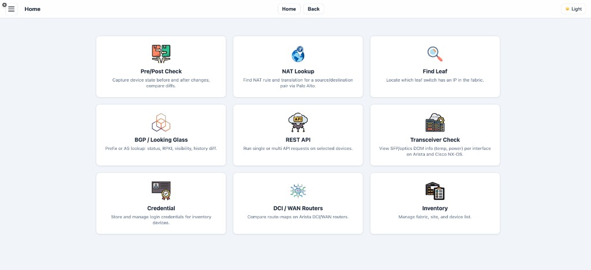

## Features

| Feature | Description |
|--------|-------------|
| **Pre/Post Check** | Capture device state before and after changes; compare diffs, save reports, export as ZIP. Interface consistency view shows devices as columns with up/down status per interface. |
| **Live Notepad** | Single shared plain-text notepad; everyone sees and edits the same content. Changes sync every few seconds (polling). No formatting. |
| **NAT Lookup** | Find NAT rule and translated IP for a source/destination pair via Palo Alto firewalls; link to BGP page with translated prefix. |
| **Find Leaf** | Locate which leaf switch has a given IP in the fabric (uses devices with tag `leaf-search`). |
| **BGP / Looking Glass** | Prefix or AS lookup via RIPEStat: status, RPKI, visibility, history diff. Per-prefix best two AS paths from one router (with router icon viz). WAN RTR search: which WAN routers have `router bgp <AS>` in config. |
| **REST API** | Run single or multi eAPI (Arista) requests on selected devices. |
| **Transceiver Check** | SFP/optics DOM (temp, power) per interface on Arista and Cisco NX-OS. |
| **Credential** | Store and manage login credentials (encrypted); reference by name in inventory. |
| **DCI / WAN Routers** | Compare route-maps on Arista DCI/WAN routers; search by prefix. |
| **Inventory** | Manage devices: hostname, IP, fabric, site, hall, vendor, model, role, tag. |

## Screenshots

Order: Home → Navigation (event popups) → Pre/Post Check → Pre/Post consistency → NAT Lookup → Find Leaf → BGP (lookup, Looking Glass table, WAN paths) → Transceiver → Credential → DCI/WAN Routers → Inventory.

**Home** — 3×3 feature cards


**Navigation** — Successful operations popup

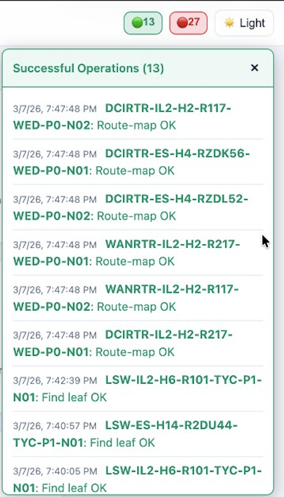

**Navigation** — Errors popup (connection refused, only Arista EOS supported)

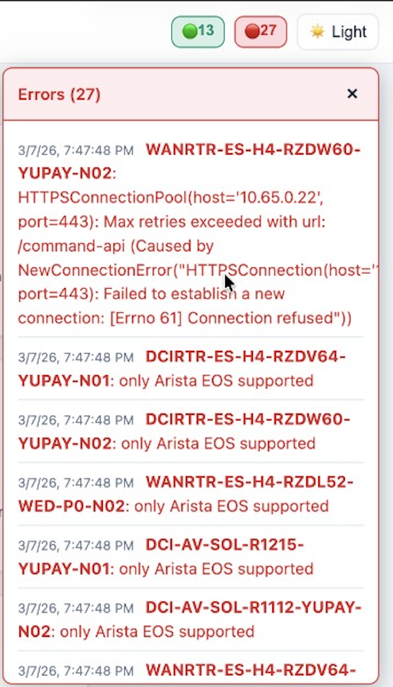

**Pre/Post Check** — Phase, filters, device list, Run PRE/POST

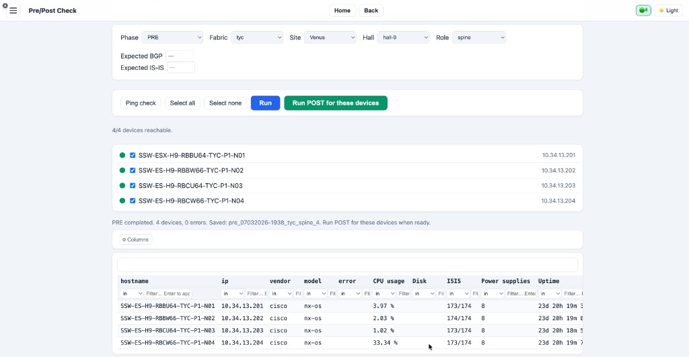

**Pre/Post** — BGP/IS-IS shortfall (DOWN interfaces) and interface consistency (column layout)

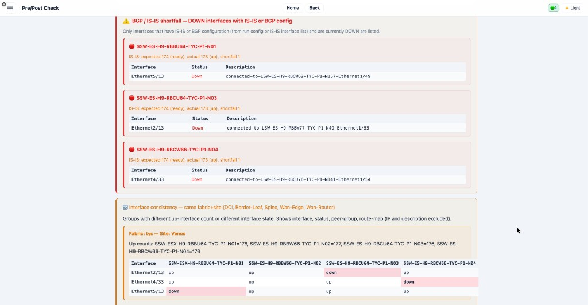

**Export ZIP (Pre/Post)** — On the Pre/Post results page, use **Export as ZIP (HTML + styles)** to download a ZIP file containing a self-contained HTML report. The report includes: the main results table (hostname, IP, vendor, model, parsed fields), BGP/IS-IS shortfall (interfaces DOWN), interface consistency (devices as columns, status per interface), ports flapped in the last 24 hours, and the PRE vs POST diff section. Styles are embedded so the ZIP can be opened offline in any browser.

**NAT Lookup** — Source/Destination IP, results with "Open on BGP page" link

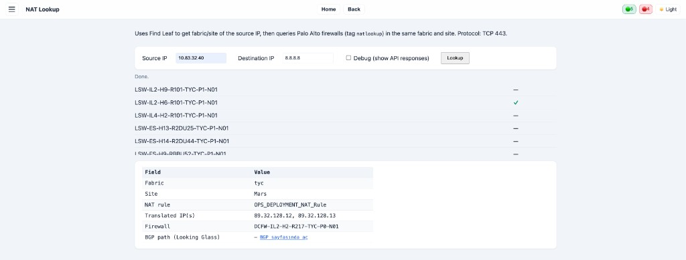

**Find Leaf** — Search by IP, found devices, leaf details

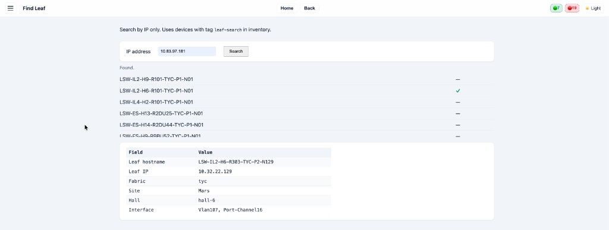

**BGP / Looking Glass** — Prefix or AS input, favourites, status cards

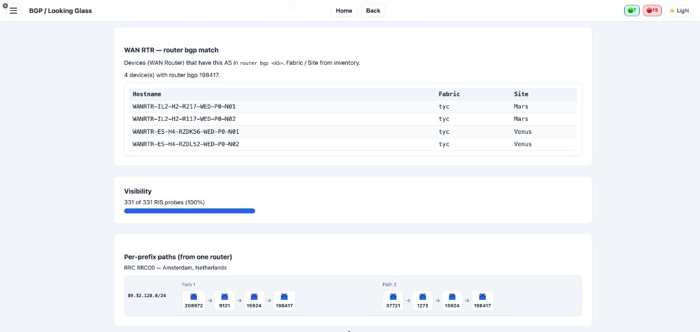

**BGP** — Looking Glass (RIS peers) and BGP play (path changes)

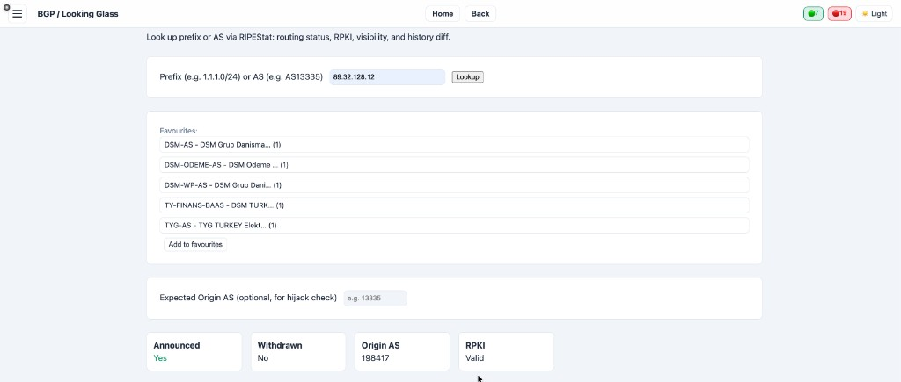

**BGP** — WAN RTR match table, visibility, per-prefix paths (Path 1 & 2)

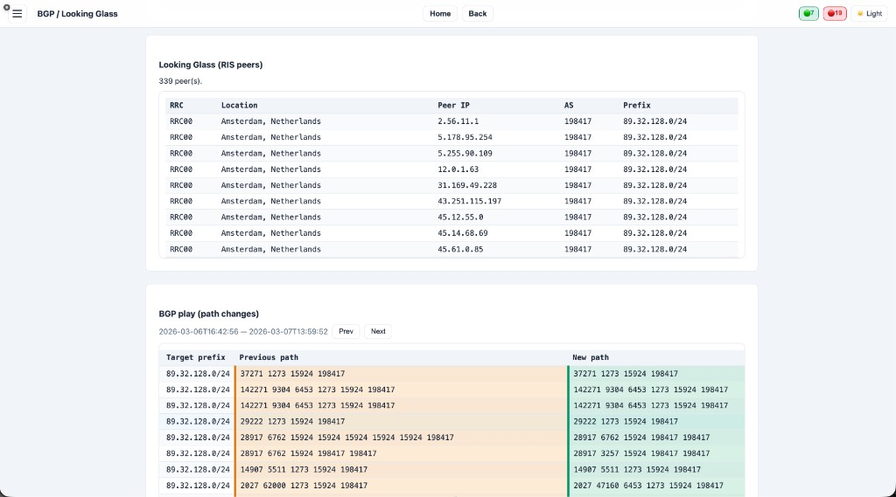

**Transceiver Check** — Device selection and DOM results (TX/RX power)

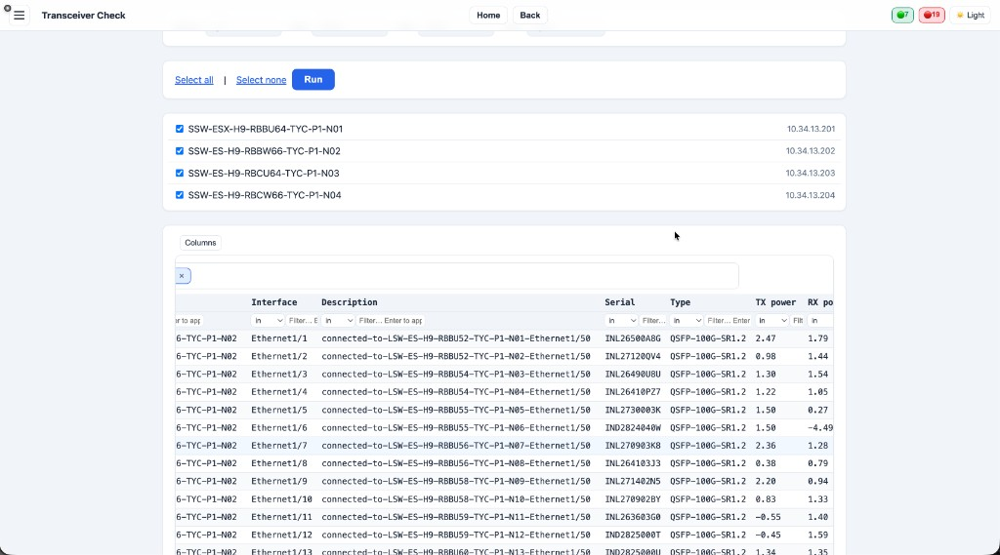

**Credential** — Add/Update form and credential table (Name, Method)

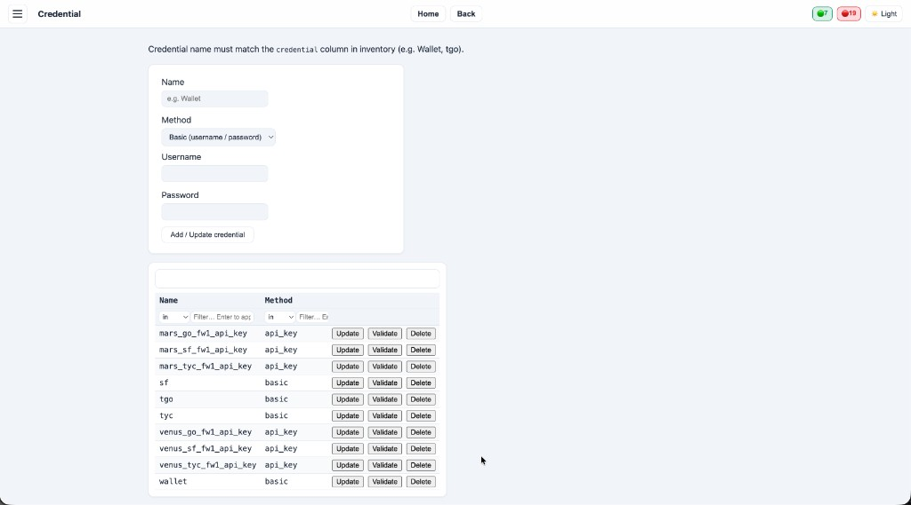

**DCI / WAN Routers** — Prefix search, route-map IN/OUT, prefix-lists

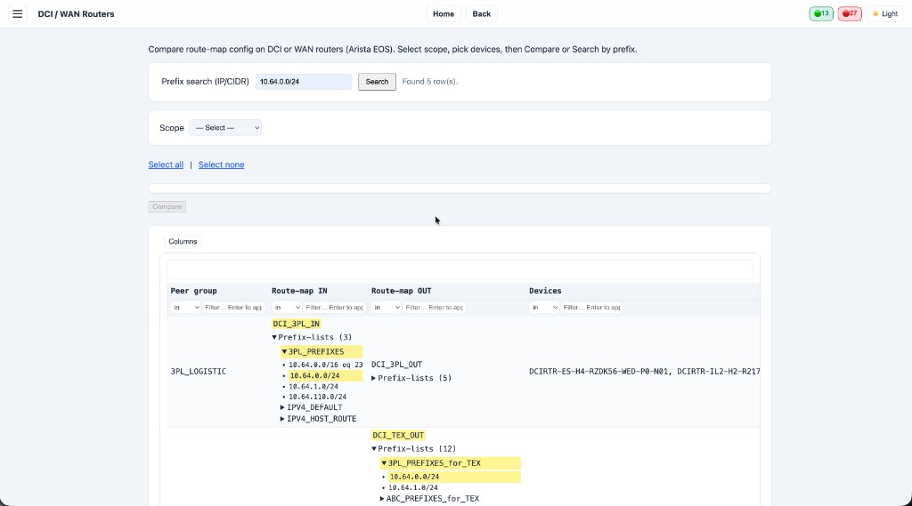

**Inventory** — Filters, Add/Edit/Import/Export, device table

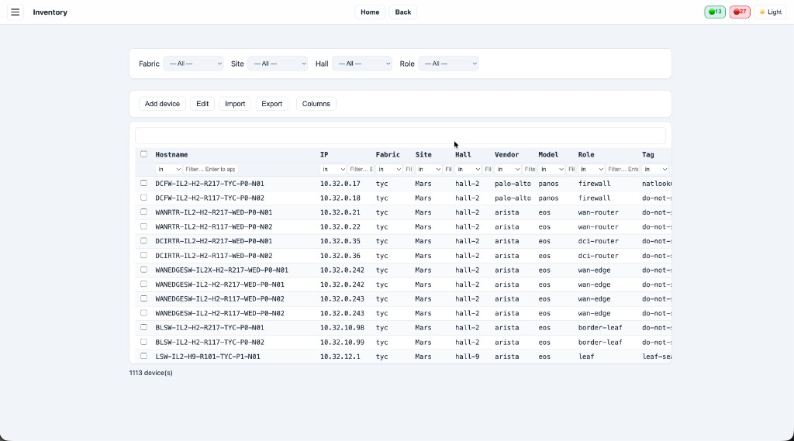

## Backend (Flask)

```bash
cd pergen
python3 -m venv venv
source venv/bin/activate   # Windows: venv\Scripts\activate
pip install -r requirements.txt
export FLASK_APP=backend.app
flask run
```

Default port **5000**. The UI is served from `backend/static/index.html` at `/`. Inventory: `backend/inventory/inventory.csv` (or `example_inventory.csv` if present, else `inventory_sample.csv`). Override with `PERGEN_INVENTORY_PATH`.

### API overview

| Endpoint | Description |
|---------|-------------|
| `GET /api/fabrics` | List fabrics |
| `GET /api/sites?fabric=` | List sites |
| `GET /api/halls?fabric=&site=` | List halls |
| `GET /api/roles?fabric=&site=&hall=` | List roles |
| `GET /api/devices?fabric=&site=&role=&hall=` | List devices |
| `POST /api/ping` | Ping devices; body `{"devices": [{"hostname","ip"}, ...]}` |
| `GET /api/inventory` | Full inventory |
| `GET /api/credentials` | List credentials |
| `POST /api/credentials` | Add credential (name, method: api_key \| basic) |
| `DELETE /api/credentials/<name>` | Delete credential |
| `GET /api/commands?vendor=&model=&role=` | Commands for device (from `backend/config/commands.yaml`) |
| `GET /api/parsers/fields` | Parser field names |
| `GET /api/parsers/<command_id>` | Parser config |
| `POST /api/run/pre` | Run PRE; returns `run_id`, `device_results` |
| `POST /api/run/post` | Run POST; body `{ "run_id": "..." }`; returns comparison |
| `GET /api/run/result/<run_id>` | Stored run (PRE/POST) |
| `GET /api/notepad` | Live notepad content (plain text) |
| `PUT /api/notepad` | Update notepad; body `{"content": "..."}` |
| `GET /api/bgp/status?prefix=&asn=` | BGP status (RIPEStat) |
| `GET /api/bgp/looking-glass?prefix=&asn=` | Looking Glass peers |
| `GET /api/bgp/wan-rtr-match?asn=` | WAN routers with `router bgp <AS>` |

## Security and Git (no credentials in repo)

These are **ignored** by Git so they are never committed:

- **`.env`** / **`.env.local`** — Environment variables (e.g. `SECRET_KEY`). Copy `.env.example` to `.env` and set your own `SECRET_KEY` locally.
- **`backend/instance/`** — Credential store (SQLite DB with encrypted passwords/API keys). Created at first run; keep it local only.
- **`backend/inventory/inventory.csv`** — Your real device list.
- **`backend/inventory/example_inventory.csv`** — Optional local sample; if present it is used when `inventory.csv` is missing. Not in the repo (gitignored).
- Repo includes only **`backend/inventory/inventory_sample.csv`** (minimal 2-row sample) as reference.

**Before pushing to your Git account:** Ensure you have no `.env` or `backend/inventory/inventory.csv` in the repo (they are in `.gitignore`). Credential *names* in inventory (e.g. `tyc`, `wallet`) are not secrets; the actual credentials are stored in the app via the Credential page and saved under `instance/`, which is gitignored.

If you already committed `inventory.csv`, `example_inventory.csv`, or `.env` in the past, remove them from Git (files stay on disk):  
`git rm --cached backend/inventory/inventory.csv` and/or `git rm --cached backend/inventory/example_inventory.csv` and/or `git rm --cached .env` then commit.

## Configuration

- **Inventory**: CSV with columns such as hostname, ip, fabric, site, hall, vendor, model, role, tag, credential. Use tag `leaf-search` for Find Leaf, `nat lookup` for NAT Lookup firewalls, role `wan-router` for BGP WAN RTR search. Put your file at `backend/inventory/inventory.csv` (or set `PERGEN_INVENTORY_PATH`). Repo contains only `inventory_sample.csv` (minimal); `inventory.csv` and `example_inventory.csv` are gitignored.
- **Credentials**: Stored encrypted in `backend/instance/credentials.db`; set credential name per device in inventory. Use **Credential** page in the app to add/update; do not commit `.env` or the `instance/` folder.
- **Binding**: Set `FLASK_RUN_HOST=0.0.0.0` for production; default is `127.0.0.1`.

## Troubleshooting

- **Connection refused (HTTPS to device)** — Device unreachable on port 443 or eAPI not enabled. Check firewall and device config.
- **“Only Arista EOS supported”** — The operation (e.g. route-map compare, WAN RTR config check) is implemented for Arista EOS. Other vendors (e.g. Cisco NX-OS) are not supported for that feature yet.
- **Event bar** — Top bar shows success (green), warnings (amber), and errors (red). Click a counter to open the event list and see timestamps and messages.

## Help

In the app, open **Help** from the menu for a short guide to each page (navigation, Pre/Post, NAT, Find Leaf, BGP, REST API, Transceiver, Credential, DCI/WAN Routers, Inventory, tables, theme).
